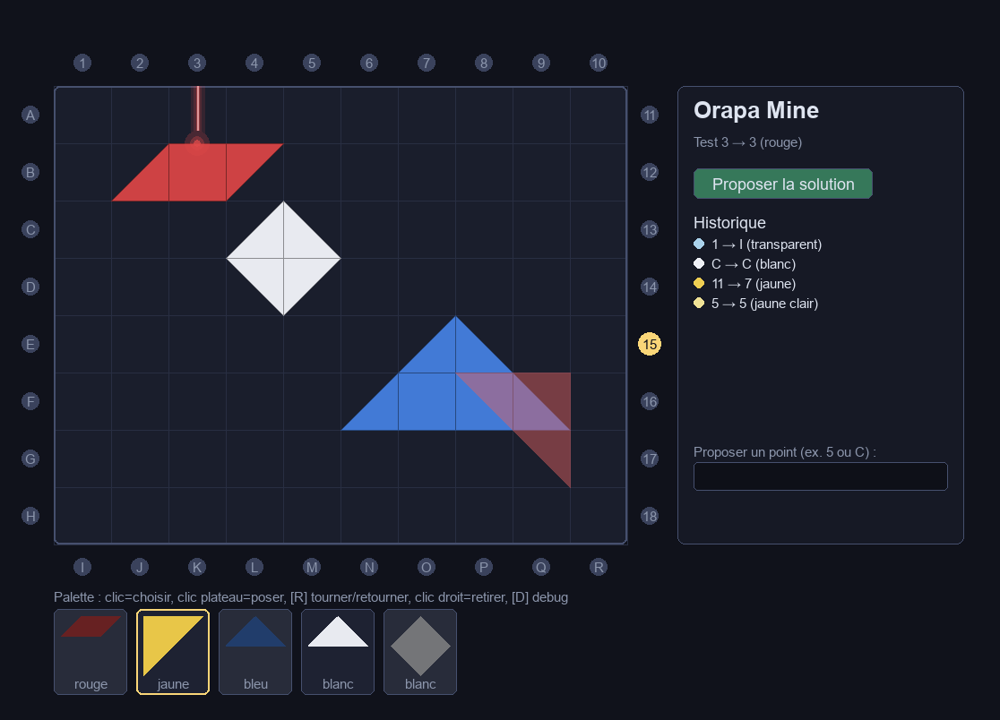

# Orapa Mine — solo vs ordinateur

Adaptation Python / **Pygame** du jeu de déduction *Orapa Mine* (Gameology /
Miraludo), en mode **solo** : l'ordinateur cache une grille de gemmes, vous
envoyez des rayons supersoniques depuis le bord du plateau et devez déduire la
position exacte de chaque gemme à partir des points de sortie et des couleurs.



## Le jeu

Les gemmes sont des pièces « tangram » (triangles, parallélogramme, losange,
rectangle) dont les arêtes réfléchissent le rayon : **90°** sur une arête
diagonale, **180°** sur une face plate. Le rayon part transparent et se
**teinte** en touchant les gemmes colorées, en mélangeant les couleurs comme de
la peinture (rouge + jaune = orange, jaune + bleu = vert…), le blanc
éclaircissant la teinte. Deux extensions : le **diamant** (dévie sans teinter)
et le **corps noir** (absorbe le rayon).

La fenêtre s'adapte à l'écran : la taille des cases est choisie automatiquement
pour que le plateau tienne sur ton moniteur, et la palette des pièces est une
bande verticale à gauche du plateau (panneau d'infos à droite).

Les règles complètes et confirmées sont dans [`docs/RULES.md`](docs/RULES.md).

## Démarrage rapide

Ce projet utilise [**uv**](https://docs.astral.sh/uv/) (pas de `pip`/`venv`
manuel).

```bash
# installer uv : https://docs.astral.sh/uv/getting-started/installation/
uv sync                       # crée .venv et installe les dépendances
uv run orapa-mine             # lance le jeu (ou : uv run python -m orapa_mine.main)
uv run pytest                 # lance les tests
```

## Comment jouer

1. **Configure** la partie : extensions (diamant / corps noir) et taille de
   grille, puis **Commencer**.
2. **Interroge la mine** : saisis un point d'entrée (chiffre **1–18** ou lettre
   **A–R**) dans « Proposer un point » puis Entrée. La vraie sortie et la
   couleur s'ajoutent à l'**Historique**.
3. **Pose tes hypothèses** : choisis une pièce dans la palette, clique sur le
   plateau pour la poser (`R` pour tourner/retourner, clic droit pour retirer).
4. **Teste** : clique un point d'entrée sur le bord pour envoyer un rayon qui
   rebondit sur **tes** pièces posées, et compare sa sortie/couleur à
   l'Historique.
5. **Propose la solution** quand tu es sûr. Le score est le nombre de questions
   posées — moins il y en a, mieux c'est.

**Sauvegarder / charger** : le bouton **Sauvegarder** enregistre la partie dans
un fichier `.json` ; coche **Progression** pour y inclure aussi l'historique et
tes pièces posées (sinon seule la configuration à deviner est enregistrée).
Recharge une partie depuis le menu de départ avec **Charger…**.

**Mode créateur** : depuis le menu de départ, **Mode créateur** ouvre un plateau
où tu places toi-même les gemmes. La **taille de la grille** et les
**extensions** se règlent directement dans l'écran (changer la taille repart
d'un plateau vide). La configuration n'est valide que lorsque **toutes** les
gemmes de la palette sont posées, sans gemmes collées ni entièrement cachées —
la validité est vérifiée en direct. Tu peux alors **sauvegarder** ta
configuration pour la **partager** (n'importe qui peut la rejouer via
**Charger…**) ou la **jouer** directement.

Raccourcis en jeu : **[H]** aide, **[S]** sauvegarder, **[Maj+D]** révéler les
gemmes (debug), **[R]** tourner une pièce, clic droit retirer, **Échap**
désélectionner.

## Structure

```
CLAUDE.md                        # Instructions pour Claude Code
docs/RULES.md                    # Règles confirmées (pièces, couleurs)
docs/ARCHITECTURE.md             # Architecture technique
.claude/skills/orapa-mine-rules/ # Skill : règles de simulation du rayon
src/orapa_mine/model/            # Logique de jeu pure (aucune dépendance UI)
  ├── gems.py / gems_catalog.py  #   géométrie des pièces (demi-cases)
  ├── grid.py                    #   grille, placement
  ├── beam.py                    #   trajectoire + mélange des couleurs
  └── game.py                    #   actions, historique, score, victoire
src/orapa_mine/ai/generator.py   # Génération + validation d'une grille cachée
src/orapa_mine/ui/               # Interface Pygame (config → jeu/créateur → fin)
tests/                           # Tests unitaires (modèle 100 % testable)
```

Règle d'or : **`model/` n'importe jamais `pygame`** — toute la logique (tracé
du rayon, déviations, couleurs) est testable sans ouvrir de fenêtre.

## Développement

```bash
uv run pytest                 # suite de tests
uv run pytest --cov=orapa_mine
```

La logique de jeu est développée en TDD à partir des scénarios de
`docs/RULES.md`. Voir [`docs/ARCHITECTURE.md`](docs/ARCHITECTURE.md) pour les
choix techniques et [`CLAUDE.md`](CLAUDE.md) pour les conventions.

## Crédits

*Orapa Mine* est un jeu de Junghee Choi & Wanjin Gill (© Gameology, édition
française Miraludo). Ce dépôt est une adaptation **solo** non officielle, à
usage personnel.
